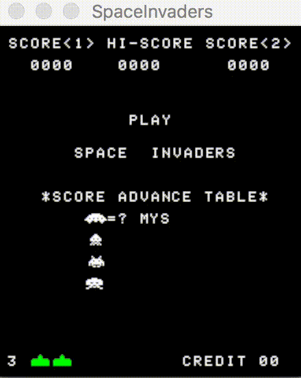

i8080 - An Intel 8080 emulator in Rust
======================================

[](https://tokei.rs)




How to run games
----------------

Before you can run individual games you need to get game and sound files you can
see the specific requirements for games below. Once you have the files it's just
a matter running the binary for the game from the `src/bin/` directory like so.

```
cargo run --release --bin invaders
```

Currently supported games
-------------------------

- **Space Invaders**


Space Invaders
--------------

### Dependencies

In order to use to play Space Invaders you need have OpenAL and libsndfile installed.

- [Linux instructions](https://github.com/jhasse/ears#linux)
- [Mac instructions](https://github.com/jhasse/ears#mac)
- [Windows instructions](https://github.com/jhasse/ears#windows)

In order to build the project you need access to MAME Space Invaders and place
them in `games/invaders/src`. It should should be four files like
`invaders.e invaders.f invaders.g invaders.h`.

In order to run space invaders you need to have the audio files in
`games/invaders/sound`. They should be `wav` and in the format `0.wav 1.wav` up
to `8.wav`.

### Controls

- Left -> Left arrow or A
- Right -> Right arrow or D
- Credit -> C
- Fire -> Space or F
- P1 START -> 1
